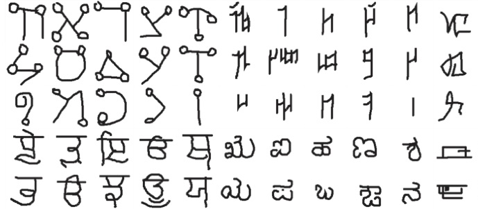
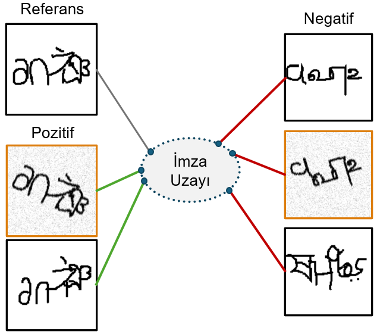
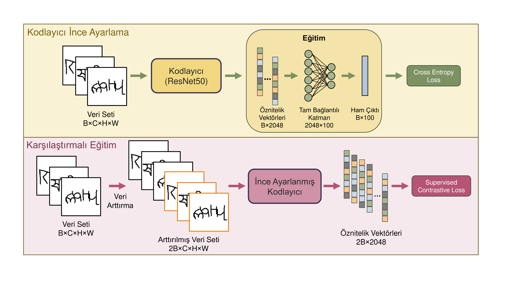

# One-Shot Signature Identification with Contrastive Learning

[](https://siu2025.isikun.edu.tr)

---

## Overview

This repository contains the official code and data for the paper:

**"One-Shot Signature Identification with Contrastive Learning"**  
Accepted at SIU 2025

Handwritten signatures are a powerful biometric authentication tool reflecting an individual's unique writing style. Despite the rise of digitalization, signatures remain crucial for identity verification, data integrity, and legal validity. This project proposes a novel signature identification method using supervised contrastive learning (SupCon), enabling the system to identify new users without retraining, thanks to a one-shot learning approach.

---


To cite our work:

```bibtex
@INPROCEEDINGS{11112336,
  author={Bilici, Abdullah and Olug, Eren and Beyden, Salim and Topal, Cihan},
  booktitle={2025 33rd Signal Processing and Communications Applications Conference (SIU)}, 
  title={One-Shot Signature Identification with Contrastive Learning}, 
  year={2025},
  volume={},
  number={},
  pages={1-4},
  keywords={Law;Face recognition;Data integrity;Neural networks;Contrastive learning;Writing;Signal processing;Digitization;Biometric authentication;Signature identification;contrastive learning;siamese neural network},
  doi={10.1109/SIU66497.2025.11112336}}
```

**Keywords:**  
Law; Face recognition; Data integrity; Neural networks; Contrastive learning; Writing; Signal processing; Digitization; Biometric authentication; Signature identification; contrastive learning; siamese neural network

---

## Key Features
- **One-shot signature identification**: Identify unseen signatures with only one example per user.
- **Supervised Contrastive Learning (SupCon)**: Outperforms traditional pairwise and triplet loss approaches.
- **Synthetic signature dataset**: Generated using the Omniglot character dataset to address data scarcity.
- **ResNet50 backbone**: Fine-tuned for robust feature extraction.
- **Open-source code and data**: For reproducibility and further research.

---

## Methodology

The system is based on a two-stage process:
1. **Base Model Training**: A ResNet50 model, pre-trained on ImageNet, is fine-tuned on a synthetic signature dataset for multi-class classification.
2. **Contrastive Fine-Tuning**: The encoder is further trained using supervised contrastive loss (SupCon), learning an embedding space where signatures from the same user are close, and different users are far apart.

The synthetic signature dataset is created by combining and augmenting Omniglot characters to mimic real signatures. This approach enables large-scale training without privacy concerns.

---

## Figures

### Omniglot Character Samples


### Synthetic Signature Examples (SupCon Training)


### Signature Identification Pipeline


---

## Results

- The SupCon-based model achieves up to **20% higher accuracy** than the baseline ResNet50 classifier.
- SupCon loss consistently outperforms pairwise and triplet loss functions across learning rates.
- The system can identify new users without retraining, making it scalable and practical for real-world applications.

---

## Installation

**Dependencies:**
- Python 3.8+
- torch
- torchvision
- numpy
- matplotlib
- scikit-learn

You can install the dependencies with:
```bash
pip install torch torchvision numpy matplotlib scikit-learn
```

---

## Usage

### 1. Data Generation
Generate synthetic signature data using the Omniglot dataset:
- See `create_data.ipynb` for data generation scripts.

### 2. Training
Train the base ResNet50 model and fine-tune with SupCon loss:
- Use `resnet50_finetune.ipynb` for base model training.
- Use `SupCon_train.ipynb` for supervised contrastive fine-tuning.
- For triplet and pairwise loss experiments, see `tripletloss_train.ipynb` and `pairloss_train.ipynb`.

### 3. Evaluation
- The notebooks include evaluation code for accuracy on seen and unseen (one-shot) signature identification tasks.

### 4. Command-Line Training (Advanced)
You can also use the scripts in `master/` for training:
```bash
python master/supcon.py --data_size small
python master/triplet.py --data_size small
```

---

## Contact
For questions or collaborations, please contact:
- Abdullah Bilici: bilicia20@itu.edu.tr
- Eren Olug: olug20@itu.edu.tr
- Salim Beyden: beyden20@itu.edu.tr
- Cihan Topal: cihantopal@itu.edu.tr
- [ITU AI and Data Engineering Department](https://www.ai.itu.edu.tr/)

---

## License
This project is released under the MIT License.
